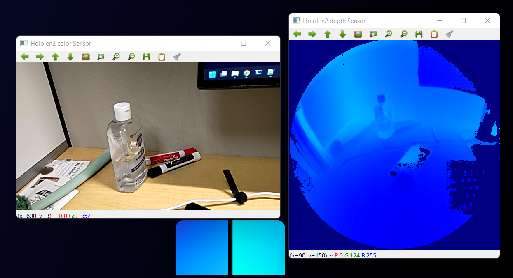
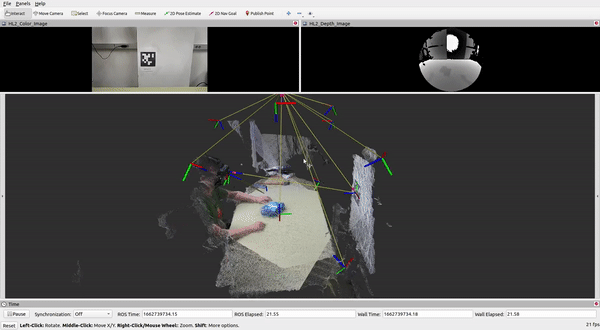
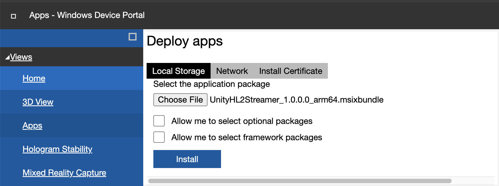
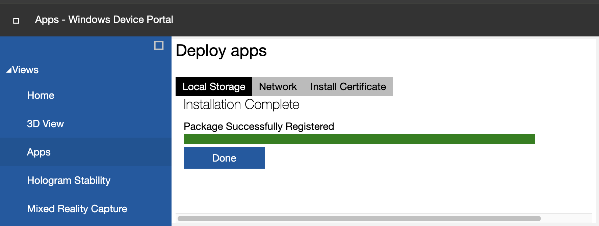

# HoloLens2ResearchModeTools

This repo includes the development tools for HoloLens2.


As the [issue#133](https://github.com/microsoft/HoloLens2ForCV/issues/133) reported, the AHAT sensor and PV camera cannot work at the same time in the latest HoloLens 2 `Release 10.0.20348.1501` (full release info is [here](https://docs.microsoft.com/en-us/hololens/hololens-release-notes)), **you might need to downgrade to previous `Release 10.0.20348.1432` for this APP working as excepted**. Use this [link](https://aka.ms/hololens2download/10.0.20348.1432) to download the release package, and follow the [Clean-reflash the device](https://docs.microsoft.com/en-us/hololens/hololens-recovery#clean-reflash-the-device) to reflash the device.

## Contents

- [`HL2ResearchModeUnityPlugin`](https://github.com/IRVLUTD/HoloLens2ResearchTools/tree/main/HL2ResearchModeUnityPlugin)
The Unity Plugin built upon the [HoloLens2ForCV](https://github.com/microsoft/HoloLens2ForCV) and [HoloLens2-Unity-ResearchModeStreamer](https://github.com/cgsaxner/HoloLens2-Unity-ResearchModeStreamer) repos.

  It serves as a streaming server and publish AHaT and PV frame streamings via predefined ports. Details are listed as below:

  - AHaT Depth Frame (Port 10091)
    - Frame header
    - Depth data (512x512@45FPS)
    - `Rig2World` transform

  - PV Frame (Port 10090)
    - Frame header
    - RGB Data (640x360@30FPS)
    - Intrinsic info (fx, fy, cx, cy)
    - `Pv2World` transform

- [`UnityHL2Streamer`](https://github.com/IRVLUTD/HoloLens2ResearchTools/tree/main/UnityProjects/UnityHL2Streamer)
The Unity Project demo to publish AHaT and PV streamings.


- PythonScripts
  - [HL2StreamingCient.py](PythonScripts\HL2StreamingCient.py)
  A demo script for subscribing streamings from HoloLens 2.
  ```shell
  python3 HL2StreamingCient.py
  ```
  

  - [HoloLens2_ROS_Publisher.py](PythonScripts\HoloLens2_ROS_Publisher.py)
    A demo Publisher script used in ROS to register streamings from HoloLens2 and publish as topics.
    ```shell
    # Publish color streaming
    python3 HoloLens2_ROS_Publisher.py --host <HoloLens_IP_Addr> --sensor_type color
    # Publish depth streaming
    python3 HoloLens2_ROS_Publisher.py --host <HoloLens_IP_Addr> --sensor_type depth
    ```
    By detecting color sensor's position with [`AprilTag ROS`](https://github.com/AprilRobotics/apriltag_ros), people could visualize hololens's pose in real time in RVIZ tool.
    

## How to Install the App in HoloLens
### Method One: use the pre-built app
The **[pre-built app](UnityProjects\UnityHL2Streamer\App\UnityHL2Streamer_1.0.0.0_arm64.msixbundle)** will publish AHaT frames via port 10091 and PV frames via port 10090.
You could install it in HoloLens 2 Windows Device Portal:
- `Views > Apps > Deploy apps > Local Storage`
- Click `Choose File` to select the downloaded app file
- Click `Install` to install it on HoloLens.
  This might take several seconds, and once finished, you could see message `Package Successfully Registered`.




### Method Two: build the App step by step
If you would like to modify the codes of [`HL2ResearchModeUnityPlugin`](https://github.com/IRVLUTD/HoloLens2ResearchTools/tree/main/HL2ResearchModeUnityPlugin) to change the streaming ports or streaming data type, one could follow the [`how_to_build.md`](doc/../docs/how_to_build.md) to build & deploy the APP.

## How to Use

- First, install/deploy the APP to HoloLens 2 device.
- Then, Launch the APP in HoloLens.
- On client side:
  - Use [HL2StreamingCient.py](PythonScripts/HL2StreamingCient.py) to simply view depth/rgb streaming.
  - Use [HoloLens2_ROS_Publisher.py](PythonScripts/HoloLens2_ROS_Publisher.py) to publish the streamings in ROS.
    - The [`rig2depth`](https://github.com/IRVLUTD/HoloLens2ResearchTools/blob/a4dc3f6c76d2aff67e239d87fe66dd8eddf17e68/PythonScripts/HoloLens2_ROS_Publisher.py#L407) transform matrix should be set based on your HoloLens device. Refer below notes to qury this matrix properly.

## Notes
- How to get rig2depth transform matrix?

  Build and run the [StreamRecorder](https://github.com/microsoft/HoloLens2ForCV/tree/main/Samples/StreamRecorder) sample on HoloLens 2, you could find the `Depth Long Throw_extrinsics.txt` file under `System->FileExplorer->LocalAppData->StreamRecorder->LocalState` via Device Portal.
- How to extract point cloud from depth image?

  HoloLens does not provide intrinsic of Depth camera, they provide a look-up-table `.bin` file to reconstruct point cloud.
  - For long throw depth, build and run the [StreamRecorder](https://github.com/microsoft/HoloLens2ForCV/tree/main/Samples/StreamRecorder) sample on HoloLens 2, you could find the `Depth Long Throw_lut.bin` file under `System->FileExplorer->LocalAppData->StreamRecorder->LocalState` via Device Portal.
  - For AHaT depth, modify code for AHaT depth, then build and run the [StreamRecorder](https://github.com/microsoft/HoloLens2ForCV/tree/main/Samples/StreamRecorder) sample on HoloLens 2, you could find the `Depth AHaT_lut.bin` file under `System->FileExplorer->LocalAppData->StreamRecorder->LocalState` via Device Portal.
