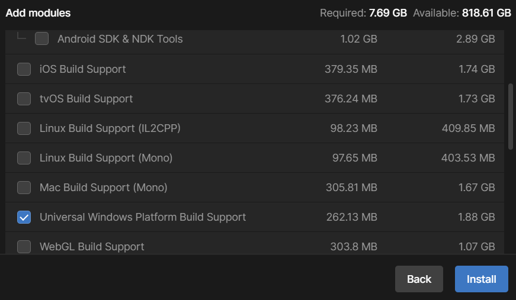
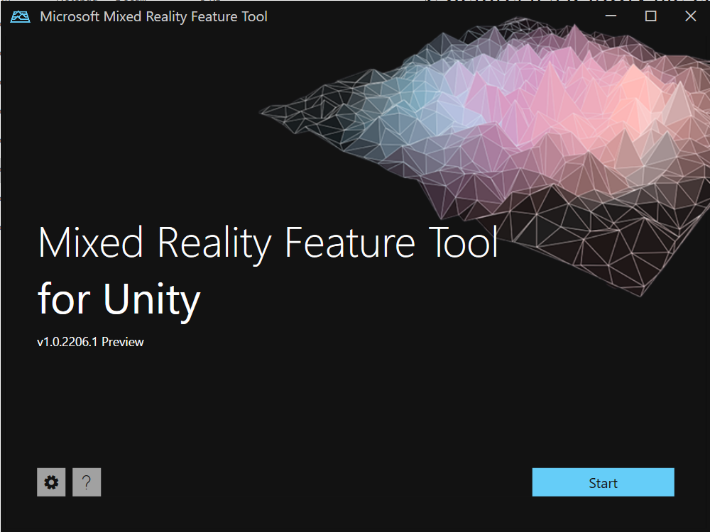
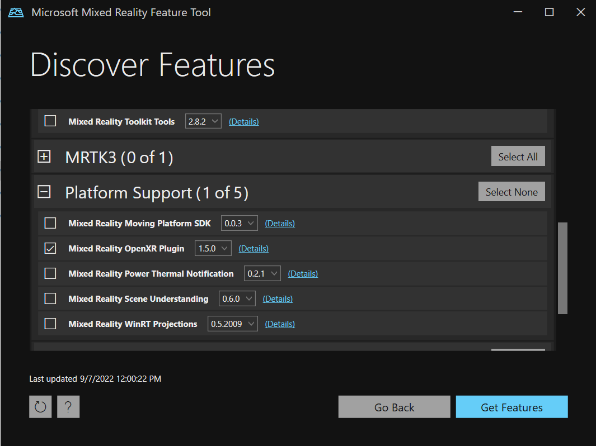
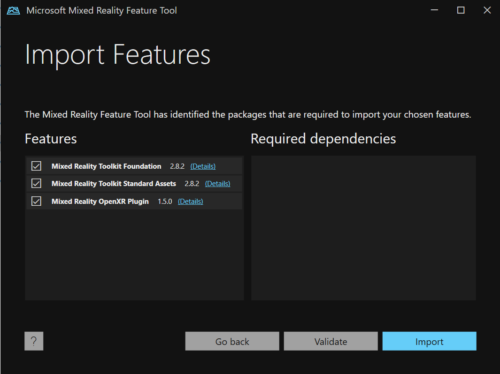
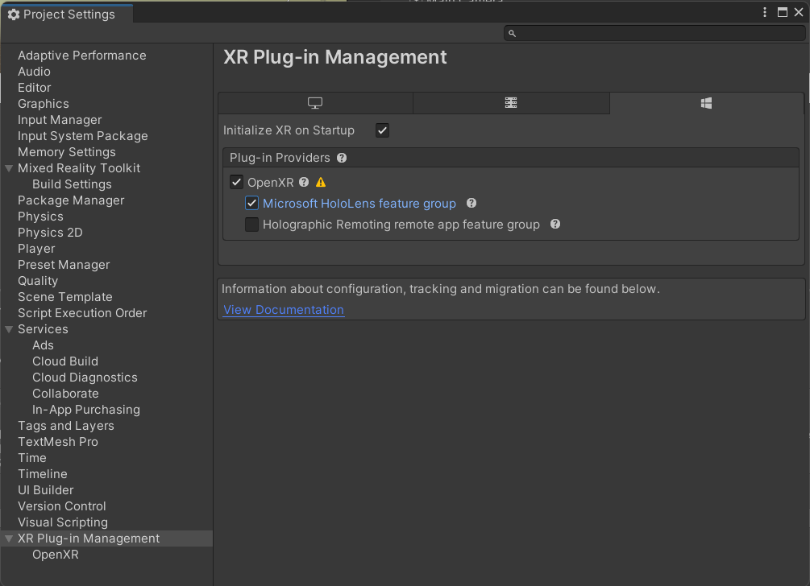
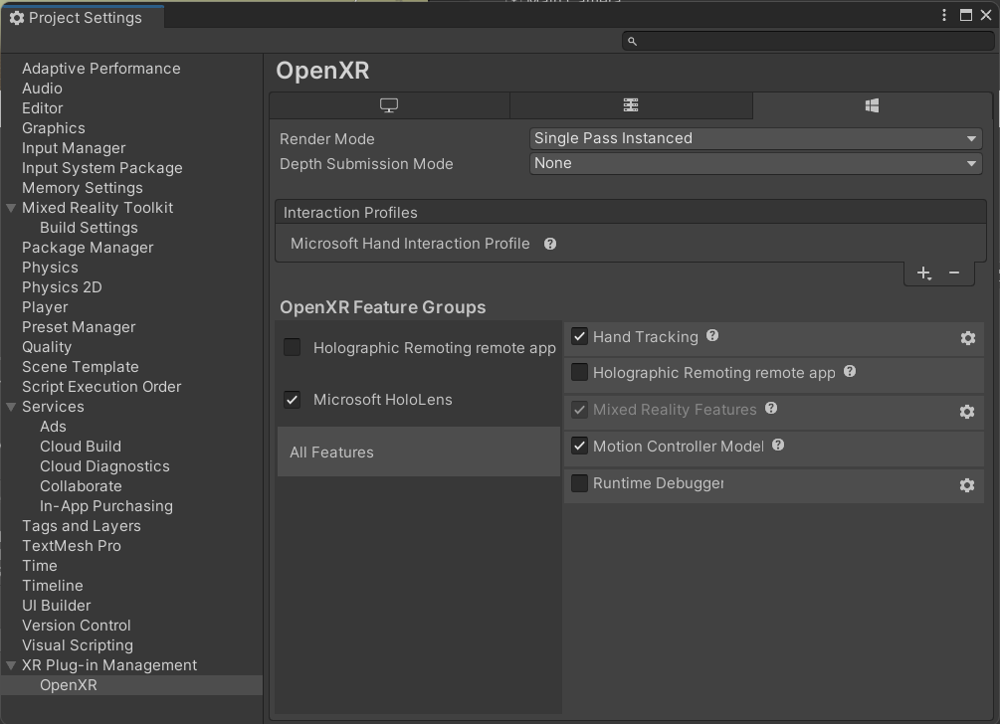
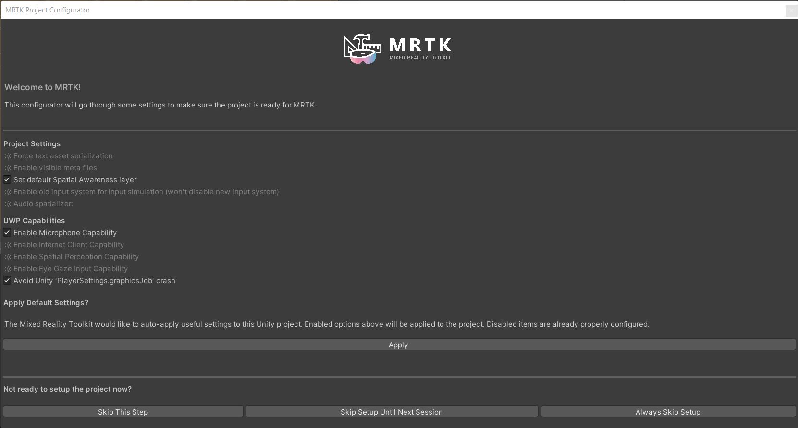
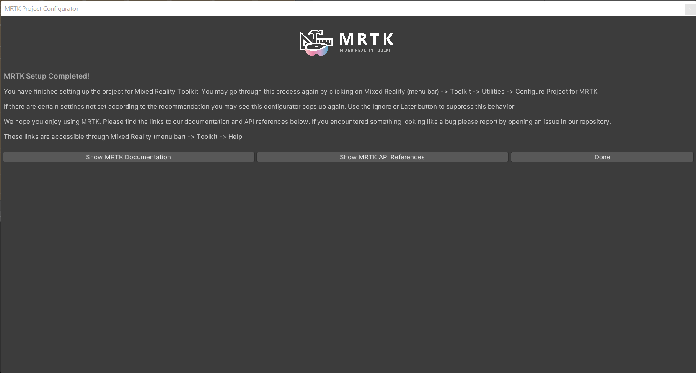

# How to Build

You could follow the step-by-step guide to build the [HL2ResearchModeUnityPlugin](https://github.com/IRVLUTD/HoloLens2ResearchTools/tree/main/HL2ResearchModeUnityPlugin) and [UnityHL2Streamer](https://github.com/IRVLUTD/HoloLens2ResearchTools/tree/main/UnityProjects/UnityHL2Streamer).

## Step 1: Setup the Development Environment

- **Desktop with Windows 10/11**
  - Enable **developer mode** at `Settings > Update & Security > For developers`
  

- **HoloLens 2**
  - **Windows Device Portal**
  The Windows Device Portal for HoloLens lets us configure and manage your device remotely over Wi-Fi/USB, it's really useful for developing (we could use [REST API](https://docs.microsoft.com/en-us/windows/mixed-reality/develop/advanced-concepts/device-portal-api-reference) to control the device programmatically). Follow steps in this [article](https://docs.microsoft.com/en-us/windows/mixed-reality/develop/advanced-concepts/using-the-windows-device-portal) to enable Windows Device Portal.

  - **Research Mode**
  Research mode allows us to access data of more sensors other than PV. Follow steps in this [article](https://docs.microsoft.com/en-us/windows/mixed-reality/develop/advanced-concepts/research-mode#enabling-research-mode-hololens-first-gen-and-hololens-2) to enable Research Mode.

- **Unity3D**
  - Download **[UnityHub](https://unity.com/download)** and install **`Unity 2021.3.9f1 LTS`**
  - The Visual Studio 2019 will be installed by default
  - Check the module **`Universal Windows Platform Build Support`**
  

- **`Visual Studio 2019`**
  Be sure following workloads are installed
  - .NET desktop development
  - Desktop development with C++
  - Universal Windows Platform (UWP) development
    - Windows 10 SDK version 10.0.18362.0
    - USB Device Connectivity
    - C++ (v142) Universal Windows Platform tools
  

## Step 2: Add MRTK Features to Unity Project
- Download the [Mixed Reality Feature Tool](https://docs.microsoft.com/en-us/windows/mixed-reality/develop/unity/welcome-to-mr-feature-tool).
- Install [.NET 5.0 runtime](https://dotnet.microsoft.com/download/dotnet/5.0).
- Unzip & launch the Mixed Reality Feature Tool
  
- Select path to your Unity Project
  
- Select & import feature packages
  - `Mixed Reality Toolkit > Mixed Reality Toolkit Foundation`
  - `Mixed Reality Toolkit > Mixed Reality Toolkit Standard Assets`
  - `Platform Support > Mixed Reality OpenXR Plugin`
  
  
  
  

## Step 3: Configure MRTK in Unity Project
- Go to your Unity project editor, you should be asked to restart editor to enable the backends
  
- Configure MRTK features
  - Click `Unity OpenXR plugin (recommended)`
  
  - Set `XR Plug-in Management Settings`
  
  - Click the yellow warning icon to fix all issues
  
  - Add `Microsoft Hand Interaction Profile` and set `Depth Submission Mode` to **`16 bit`**
  
  - Apply Settings for first time setup
  
  - Select all `Project Settings` and `UWP Capabilities`, then click `Apply`
  
  - Import the `TextMeshPro`
  
  - Finish the MRTK setup
  

## Step 4: Build the [`HL2ResearchModeUnityPlugin`](https://github.com/IRVLUTD/HoloLens2ResearchTools/tree/main/HL2ResearchModeUnityPlugin) with Visual Studio
- Open the plugin solution in Visual Studio.
- Build the solution for **`Release, ARM64`**.
You could find the `HL2ResearchModeUnityPlugin.dll` under `HL2ResearchModeUnityPlugin > ARM64 > Release > HL2RmStreamUnityPlugin`.

## Step 5: Build the Unity Project [`UnityHL2Streamer`](https://github.com/IRVLUTD/HoloLens2ResearchTools/tree/main/UnityProjects/UnityHL2Streamer)
- Create the folder `Assets/Plugins/WSA/ARM64`.
- Copy the `HL2ResearchModeUnityPlugin.dll` to the folder created in last step.
- Then modify the import settings for the `.dll` file
  - `SDK > UWP`
  - `CPU > ARM64`
   
- Config the `Build Settings` with `File > Build Settings` as below:
  - `Architecture > ARM 64-bit`
  - `Target SDK Version > 10.0.20348.0`
  - `Minimum Platform Version > 10.0.18362.0`
  - `Build Configuration > Release`
   
- Make sure following Capabilities are enabled in `Build Settings > Player Settings`:
  - InternetClient
  - InternetClientServer
  - PrivateNetworkClientServer
  - WebCam
  - SpatialPerception
  
- Build the Unity Project by clicking `Build`
  You need to create & select a folder to save the built files
- Open the built solution in Visual Studio.
  - Open the `Package.appxmanifest` in the solution in a text editor to add the restricted capability to the manifest file for research mode:
  - Add rescap package to `<Package>`
  `xmlns:rescap="http://schemas.microsoft.com/appx/manifest/foundation/windows10/restrictedcapabilities"`
  - Add rescap to the Ignorable Namespaces under `<Package>`
  `IgnorableNamespaces="... rescap"`
  - Add rescap capability to `<Capabilities>`
  `<rescap:Capability Name="perceptionSensorsExperimental" />`
    - an example is listed below (`<DeviceCapability Name="backgroundSpatialPerception"/>` is only necessary if you use IMU sensor)
     ```xml
     <Package
         xmlns:mp="http://schemas.microsoft.com/appx/2014/phone/manifest"
         xmlns:uap="http://schemas.microsoft.com/appx/manifest/uap/windows10"
         xmlns:uap2="http://schemas.microsoft.com/appx/manifest/uap/windows10/2"
         xmlns:uap3="http://schemas.microsoft.com/appx/manifest/uap/windows10/3"
         xmlns:uap4="http://schemas.microsoft.com/appx/manifest/uap/windows10/4"
         xmlns:iot="http://schemas.microsoft.com/appx/manifest/iot/windows10"
         xmlns:mobile="http://schemas.microsoft.com/appx/manifest/mobile/windows10"
         xmlns:rescap="http://schemas.microsoft.com/appx/manifest/foundation/windows10/restrictedcapabilities"
         IgnorableNamespaces="uap uap2 uap3 uap4 mp mobile iot rescap"
         xmlns="http://schemas.microsoft.com/appx/manifest/foundation/windows10">

     <Capabilities>
         <rescap:Capability Name="perceptionSensorsExperimental" />
         <Capability Name="internetClient" />
         <Capability Name="internetClientServer" />
         <Capability Name="privateNetworkClientServer" />
         <uap2:Capability Name="spatialPerception" />
         <DeviceCapability Name="webcam" />
     </Capabilities>
     ```
       - Build solution for `Release, ARM64`
       - Deploy to HoloLens 2.
      For details of deploying, please refer to this [article](https://docs.microsoft.com/en-us/windows/mixed-reality/develop/advanced-concepts/using-visual-studio?tabs=hl2#deploying-a-hololens-app-over-wi-fi-or-usb).
